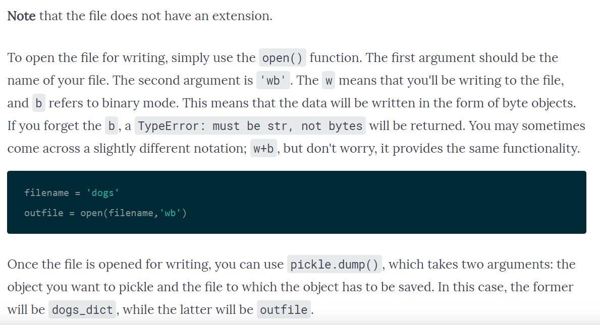
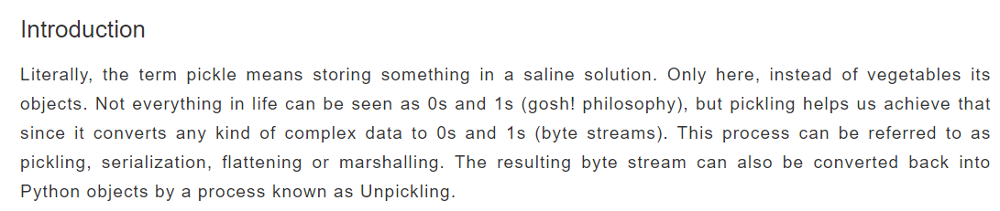
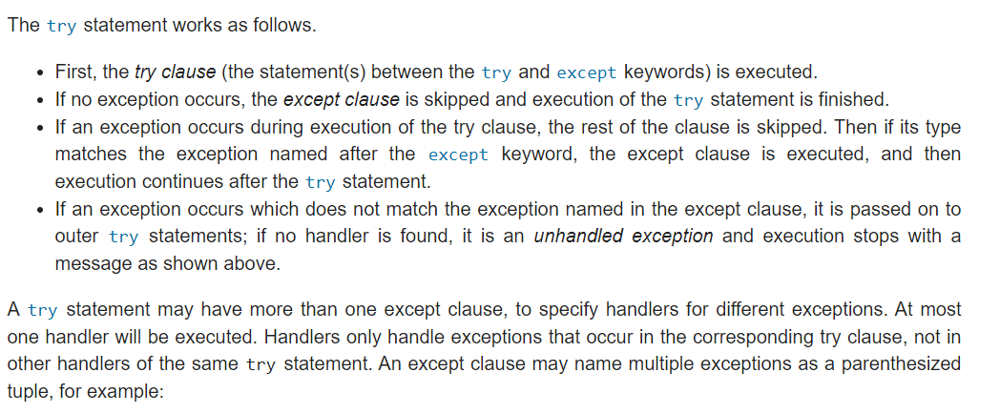
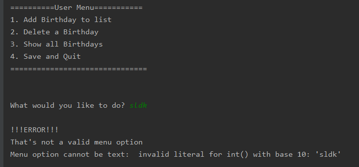
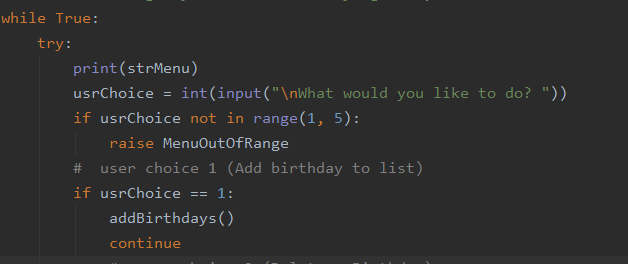

  Lacey Redinger  
  11/18/19  
  Foundations of Programming: Python  
  Assignment 07  
  https://github.com/lacerock/IntroToProg-Python-Mod07 (external)  

# There’s an Error in My Pickle
## Introduction
In this module we learned about handling errors using a try and except blocks as well as serializing data, or pickling, into a binary file. The primary focus of this module was to learn via research, which is a pretty common way to learn in real life. Most coders still have to look up code or ideas about how to do the thing they imagine in their mind. Our goals were to research pickling and try/except error handling and create a script demonstrating both. Finally, we learned a bit about Markdown (the language used by GitHub) and how to create document/wiki-type pages on GitHub.
## Pickling
### Tutorials
I liked this tutorial https://www.datacamp.com/community/tutorials/pickle-python-tutorial because of the way they highlighted, defined, and explained each element as it was used. (Figure 1) I also liked that they included real examples of how it might be used or how it couldn’t be used. This gave me context for how to understand what the code is actually doing. (I’m a what/why learner).

***Figure 1: Datacamp Tutorial***

I also liked this tutorial: https://www.pythoncentral.io/how-to-pickle-unpickle-tutorial/ (external) Because I thought the way they explained the general concepts of pickling were relatable. (Figure 2)

***Figure 2: PythonCentral Tutorial***

### Pickling in My Script
Some other things I leaned about pickling came from trial and error in my script, an explanation from a co-worker, and other random bits or answered questions on StackOverflow.com. For example, when converting data into binary form (serialization aka Pickling) there is a FIFO (first in, first out) structure. One of the issues I had with my script was that if a user saved multiple sets of data to the file, each time that happened, the .dat file was appending the old data + the new data to a new “line” making the previous lines of data in the file obsolete. However, when I wanted to pull the data from the file using 
objFileData = pickle.load(objFile) it was pulling the FIRST data saved to the file not the most recent or LAST data saved to the file. One way to solve this would be to loop through all the lines of data in the file and read only the last line, which would work fine for this small script, but is highly impractical in real life. It would essentially deteriorate the file because every time you ran the program and saved data, the binary file would grow larger and larger with obsolete data. This is a waste of memory and it would also make the program run slower and slower over time. Instead, I decided to load the existing data into a list object within the script, then delete the old file and create a new one. So each time the user saves new data, in the background their file is “refreshing.” This created some other kinds of errors which I will discuss in the error handling section. 
Pickle is a set of code in Python that can be imported into any script that needs to use the functions associated with it. It’s kind of like a subfolder of code which you only open (import) if you need it. In order for my strategy of finding any existing .dat file associated with my program to work, I needed code to locate that file on my computer and pull its data once found. So I imported OS into my script which is another set of code (like Pickle) which I can import into my script to use it’s associated functions. But this only solved part of my problem. I had all kinds of errors to handle in my script!

## Try/Except Error Handling
### Tutorials
I liked this tutorial which is part of the official Python documentation. https://docs.python.org/3/tutorial/errors.html (external) I found this particular part very helpful in understanding how the try and except blocks run or don’t run depending on what the user enters (Figure 3)

***Figure 3: Python Documentation – Try and Except Error Handling***

Another helpful thing in this document was about creating a Class of custom errors, which I ended up using in my program. For example: 
*class MenuOutOfRange(Exception):
    pass*
I created this custom exception to handle an error when the user entered a number less than 1 or greater than 12 (the number of months in a year). Once this class is created and defined at the top of the script, I can then call it (like a function) at the place where I want to catch the potential error. Then at the end of the script I have all my except blocks with custom print messages to the user.
### Error Handling in My Script
My script is a simple program for a user to enter birthdays into a list. I created and used exceptions in several different ways. 
  1.	Class exceptions called later, like functions. 
  2.	Raise exceptions within the main script
  3.	Standard Python Exceptions
  4.	Try/except blocks within functions
  5.	Try/except blocks in the main script

The first thing I wanted to do was limit my user to entering an integer corresponding to the 4 menu options. So I needed an exception for string data. I chose to use a standard Python exception ValueError and then print out part of the Python error message, as well as my own friendly explanation. (Figure 4)  

***Figure 4: ValueError Exception***
Next I needed an exception to handle the user entering an integer out of range. For this I created class MenuOutOfRange(Exception) and then called it within my try/except block (Figure 5)  

***Figure 5: MenuOutOfRange Exception***
I made a few exceptions in this way, one for the user entering a valid month and valid day to create a “birthday” which is a list inside a larger list: bDayList[]. In an earlier version of my script I had used a FileNotFound exception, but I ended up eliminating that and using import OS to locate any existing file and pull the data into the script and delete the file. This solved 2 problems: first, it eliminated my issues with FIFO binary data, while efficiently managing that data. Second, it makes sure there is always either an existing file to pull data from, or creates a new file to add data to. 
## MarkDown: Creating GitHub webpages
MarkDown is the language used by GitHub which is sort of like an HTML converter. It is very similar to MediaWiki or other HTML-type languages used in wikis or platforms like Atlassian/Jira. I am very familiar with writing wikis and other types of online documentation, so this part was not too challenging. It can be time-consuming to convert from Word, but not difficult.
## Summary
This assignment was one of the more challenging ones because it required a lot of application of previous knowledge. Other assignments have focused on one main new thing, or had supplemental code, but here we were asked to start from scratch, create a new script to not only demonstrate our newly acquired knowledge of Pickling and Error Handling, but also using all previous knowledge to build the program. Success would depend, in many cases, on how skilled a person is at internet research, as well as learning and filtering that data in order apply it.

